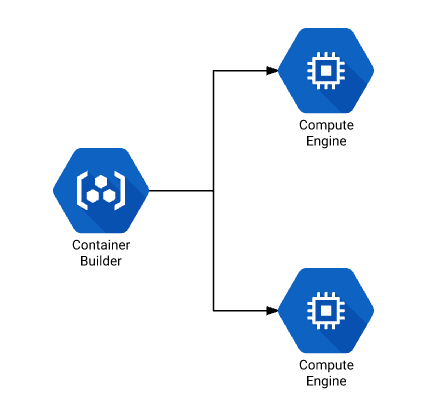

# About This Repository

## Summary

This repository is a fork of [GoogleCloudPlatform/cloud-builders-community](https://github.com/GoogleCloudPlatform/cloud-builders-community), modified to build Docker images remotely.

## License

I do not claim the license of this repository myself, but inherit and follow the license of the repository from which I forked. Please refer to [LICENSE](LICENSE) if you want to know specific details.

# Cloud Build Remote Build Step

## Introduction



Some continuous integration workloads require special builder types. You may
require things like:

1. High CPU/Memory machines
1. Custom image
1. GPUs attached
1. Fast or large disks
1. Machines in a particular network
1. Pre-emptibility

In these cases you can leverage Container Builder to trigger your builds and
manage their workflow but run the actual build steps on an instance with
exactly the configuration you need.

## How?

When using the remote-builder image, the following will happen:

1. A temporary SSH key will be created in your Container Builder workspace
1. A instance will be launched with your configured flags
1. The workpace will be copied to the remote instance
1. Your command will be run inside that instance's workspace

## Usage

In order to use this step, first build the builder:

```
gcloud builds submit --config ./cloudbuild.yaml .
```

Then, create an appropriate IAM role with permissions to create and destroy
Compute Engine instances in this project:

```
export PROJECT=$(gcloud info --format='value(config.project)')
export PROJECT_NUMBER=$(gcloud projects describe $PROJECT --format 'value(projectNumber)')
export CB_SA_EMAIL=$PROJECT_NUMBER@cloudbuild.gserviceaccount.com
gcloud services enable cloudbuild.googleapis.com
gcloud services enable compute.googleapis.com
gcloud projects add-iam-policy-binding $PROJECT --member=serviceAccount:$CB_SA_EMAIL --role='roles/iam.serviceAccountUser' --role='roles/compute.instanceAdmin.v1' --role='roles/iam.serviceAccountActor'
```

Then, configure your build step as follows:

```
steps:
- name: gcr.io/$PROJECT_ID/docker-remote-builder
  env:
    - COMMAND=ls -la
```

This will launch an instance with the default parameters and then run the
command `ls -la` inside the instance's workspace.

## Configuration

The following options are configurable via environment variables passed to the
build step in the `env` parameter:

| Options       | Description   | Default |
| ------------- | ------------- | ------- |
| COMMAND | Command to run inside the remote workspace | None, must be set |
| USER_NAME  | Username to use when logging into the instance via SSH  | `builder` |
| REMOTE_WORKSPACE  | Location on remote host to use as workspace | `/home/${USERNAME}/workspace/` |
| INSTANCE_NAME  | Name of the instance that is launched  | `docker-remote-builder-$UUID` |
| ZONE  | Compute zone to launch the instance in | `asia-southeast1-b` |
| INSTANCE_ARGS| Parameters to the instance creation command. For a full list run `gcloud compute instances create --help` | `--preemptible` |
| INSTANCE_SPOT_ARGS| It has the same purpose as INSTANCE_ARGS and is used in conjunction with it | `--no-restart-on-failure --maintenance-policy=TERMINATE --provisioning-model=SPOT --instance-termination-action=DELETE --max-run-duration=$INSTANCE_MAX_DURATION` |
| INSTANCE_MAX_DURATION | The maximum uptime of the instance and is used in the default of INSTANCE_SPOT_ARGS | `3600s` |
| RETRIES| The number of retries to wait for the instance to start accepting SSH connections | `10` |

## Example

[example](example) directory contains example for building AMD64 and ARM64 multiplatform Docker image.
The following command will build and push `gcr.io/$PROJECT_ID/docker-remote-builder-example:0.0.0`.

```
gcloud builds submit --config ./example/cloudbuild.yaml ./example/
```

## Trade-offs

1. Paying for builder + VM
2. Spin up time of VM increases build time

